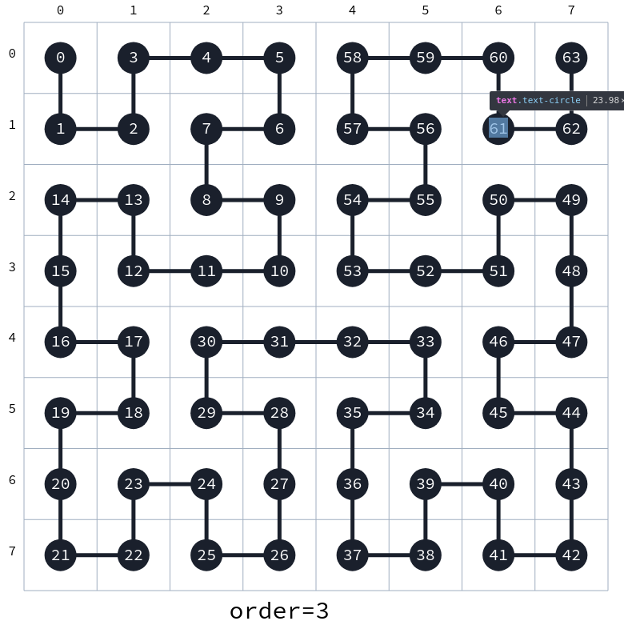

# Hilbert curve mapping

## Installation

```bash
npm install hilbert-curve
```

## Usage

Node:

```javascript
const hilbertCurve = require("hilbert-curve");

// or

import * as hilbertCurve from "hilbert-curve";
```

Browser:

```html
<!-- unpkg -->
<script src="https://unpkg.com/hilbert-curve"></script>

<!-- jsdelivr -->
<script src="https://cdn.jsdelivr.net/npm/hilbert-curve"></script>
```



### `hilbertCurve.indexToPoint(index, order)`

Given an index `index`, return the point on the Hilbert curve of order `order`
(the length of the entire curve being `2^order * 2^order`), e.g.

```javascript
// order is 3, i.e. curve is defined on a 2^3 * 2^3 = 8 * 8 square
hilbertCurve.indexToPoint(17, 3);
// { x: 1, y: 4 }
```

### `hilbertCurve.pointToIndex({x, y}, order)`

Inverse: given a point `{x,y}` on the Hilbert curve of order `order`, return the index, e.g.

```javascript
hilbertCurve.pointToIndex({ x: 5, y: 2 }, 3);
// 55
```

### `hilbertCurve.construct(data, [order], [pickRepresentative])`

Construct the Hilbert curve of `data`, and optionally specify its `order`.
`data` has to be an array or an object that can be converted to an
array using
[`Array.from()`](https://developer.mozilla.org/en-US/docs/Web/JavaScript/Reference/Global_Objects/Array/from).

If no order is given, a curve of order
`Math.ceil(Math.log2(Math.sqrt(data.length)))` is constructed.
Note that if `data.length` is not a power of 2, the curve will contain empty/undefined
items.

If an `order` is given that is smaller than `Math.ceil(Math.log2(Math.sqrt(data.length)))`,
the values of `data` will first be binned using
[`@mhyfritz/bin-data`](https://github.com/mhyfritz/bin-data). By
default, numeric data is assumed and the maximum value is picked for every chunk, however,
a function `pickRepresentative` can be passed as a third argument to `construct`.
For more details on this, confer the docs of
[`@mhyfritz/bin-data`](https://github.com/mhyfritz/bin-data).

Example:

```javascript
// data is `[1, 2, 3, ..., 14, 15, 16]`
const data = Array.from({ length: 4 * 4 }, (_, i) => i + 1);
hilbertCurve.construct(data, 2);
// [1, 2, 15, 16, 4, 3, 14, 13, 5, 8, 9, 12, 6, 7, 10, 11]
// to be interpreted as 4x4 square:
//  1  2 15 16
//  4  3 14 13
//  5  8  9 12
//  6  7 10 11
```

[Try `hilbert-curve` in your browser.](https://npm.runkit.com/hilbert-curve)
